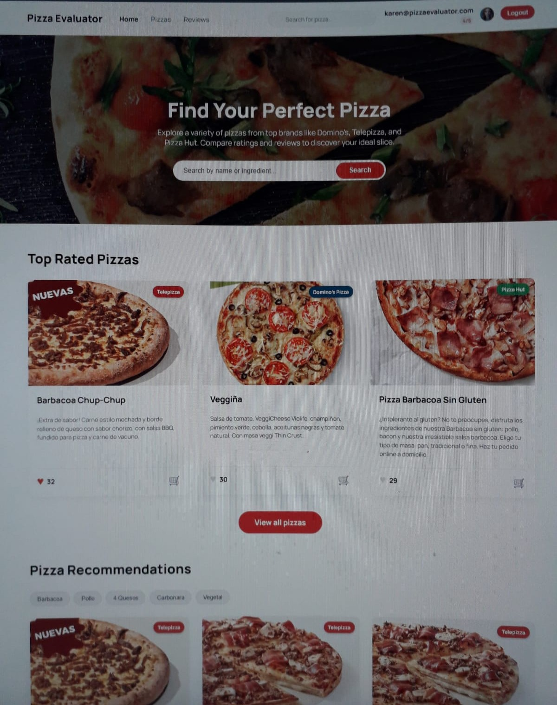
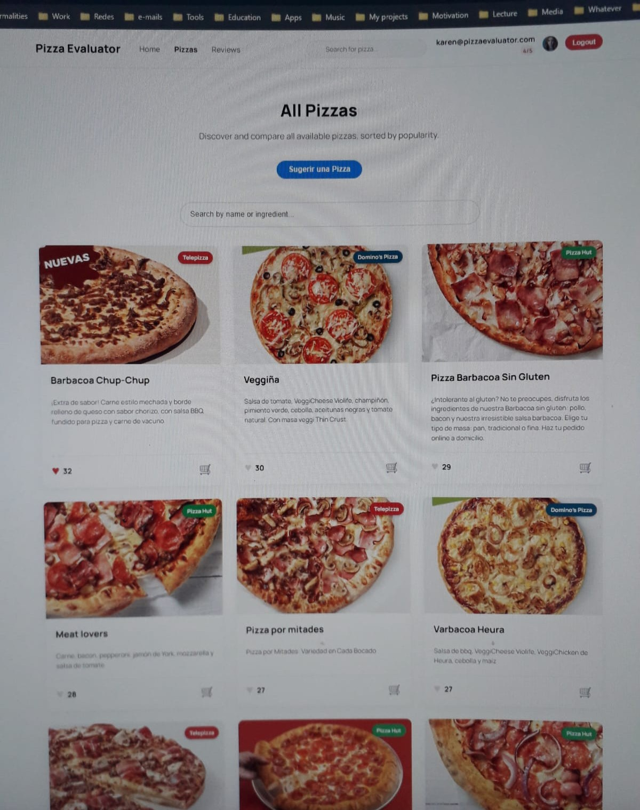
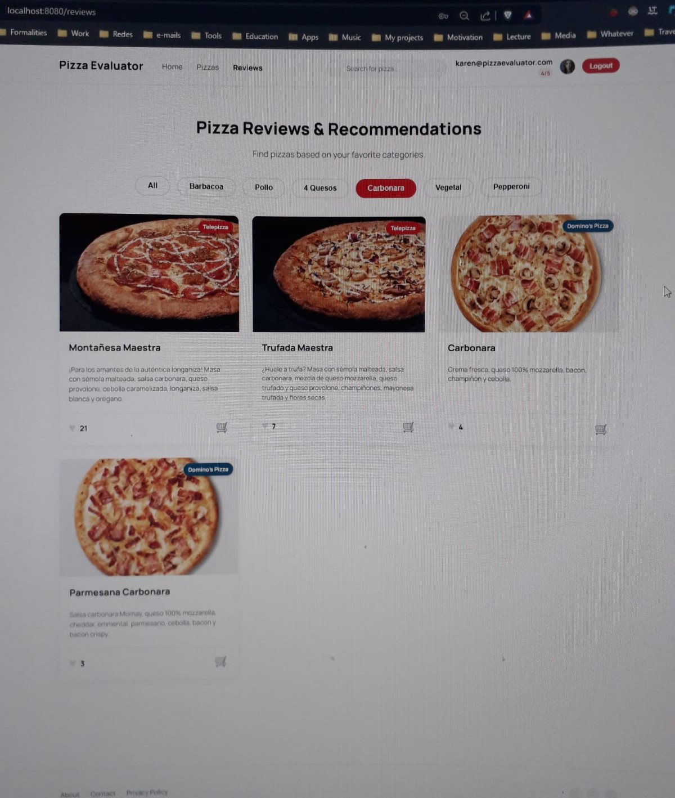
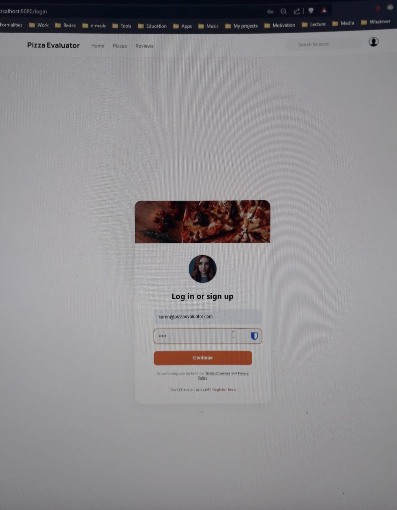
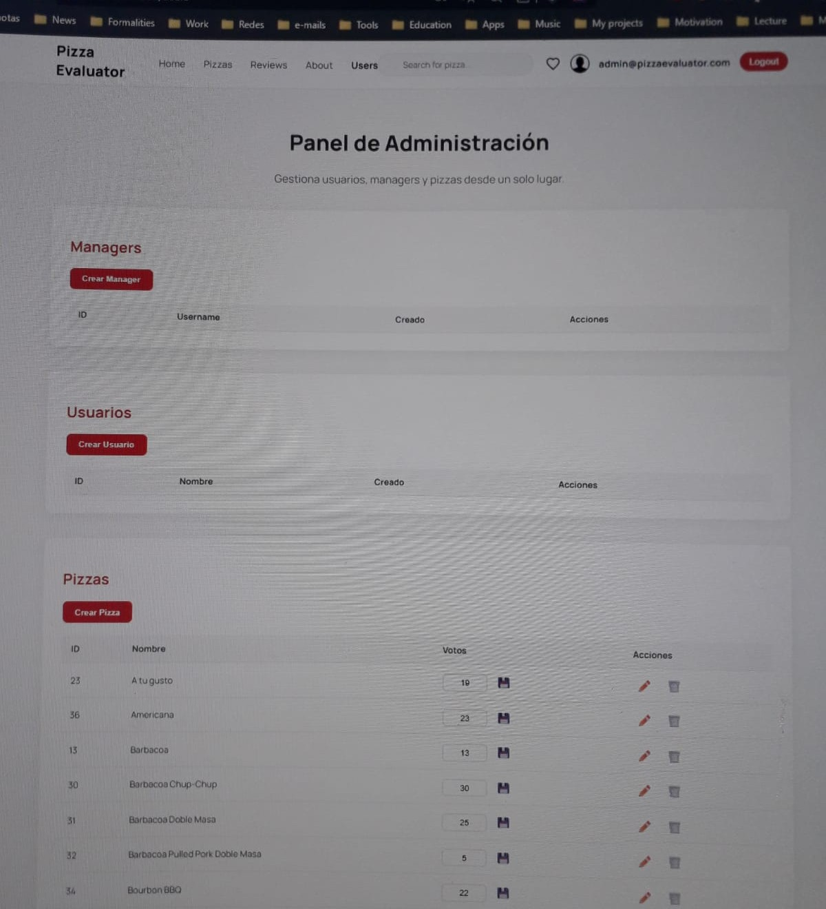

# 🍕 Pizza Evaluator 🍕

**Find, vote, and compare the best pizzas on the market. A full-stack platform for pizza lovers.**


## 📜 Description

Pizza Evaluator is a full-stack web application that allows users to explore a catalog of pizzas from different brands (Domino's, Telepizza, Pizza Hut), vote for their favorites, and view a popularity-based ranking. The application features an administration panel to manage users, pizzas, and managers.

This project was conceived as a comprehensive solution to centralize opinions and aid in decision-making, implementing a modern tech stack and a robust architecture. It was started during my third year of Computer Science Engineering, and I was very eager to finish it someday.

## ✨ Key Features

-   **Dynamic Pizza Catalog**: Explore pizzas from multiple suppliers.
-   **Voting System**: Registered users can vote for their favorite pizzas (with a limit of 5 votes per user).
-   **Real-Time Ranking**: The home page displays the top-rated pizzas.
-   **Search and Filters**: Search for pizzas by name or ingredient and filter by categories.
-   **User Authentication**: Secure registration and login system.
-   **Admin Panel**: A dedicated interface for administrators to manage all application data.
-   **Modern and Responsive Design**: Attractive user interface adaptable to different devices.

## 🖼️ Application Gallery

| Home - Main Page                               | Pizzas - Full Catalog                            |
| ---------------------------------------------- | ------------------------------------------------ |
|           |       |

| Reviews - Recommendations                      | Login - User Access                              |
| ---------------------------------------------- | ------------------------------------------------ |
|     |           |

| Admin Panel (Users)                            |
| ---------------------------------------------- |
|        |

## ⚙️ Tech Stack

The application is built with a client-server architecture:

### Frontend
-   **Vue.js**: A progressive JavaScript framework for building user interfaces.
-   **Vuex**: As a centralized state management pattern and library for all application components.
-   **Vue Router**: For managing routes in this Single Page Application (SPA).
-   **Sass (SCSS)**: For more powerful and organized styling.
-   **Axios**: For making HTTP requests to the backend.

### Backend
-   **Node.js**: JavaScript runtime environment on the server side.
-   **Express**: Framework for creating the REST API and managing routes.
-   **Sequelize**: A Node.js ORM (Object-Relational Mapper) that simplifies database interaction.
-   **SQLite**: A lightweight, file-based SQL database, ideal for development and rapid prototyping.
-   **Multer**: Middleware for handling file uploads (user avatars).
-   **Puppeteer**: For web scraping to populate the database with pizzas from Pizza Hut.

## 🧠 Featured Logic

-   **Database Synchronization with `alter: true`**: During development, the `{ alter: true }` option from Sequelize was used to automatically adjust the database tables to match the model changes. To prevent unique constraint errors with backup tables (`users_backup`), a solution was implemented to drop these backup tables before each synchronization.

    ```javascript
    // server/src/app.js
    await sequelize.query('DROP TABLE IF EXISTS users_backup;');
    await sequelize.sync({ alter: true });
    ```

-   **Voting System**: The business logic for voting is centralized in the `usersController`. When a user votes, the backend checks if they have votes available and if they have already voted for that pizza, updating the corresponding counters in the `users` and `pizzas` tables.

## 🚀 Installation and Usage

To get the project up and running on your local environment, follow these steps:

### 1. Prerequisites
-   Have [Node.js](https://nodejs.org/) (which includes npm) installed.

### 2. Clone the Repository
```bash
git clone https://github.com/ivancastroprojects/pizza-evaluator-app.git
cd pizza-evaluator-app
```

### 3. Install Backend Dependencies
```